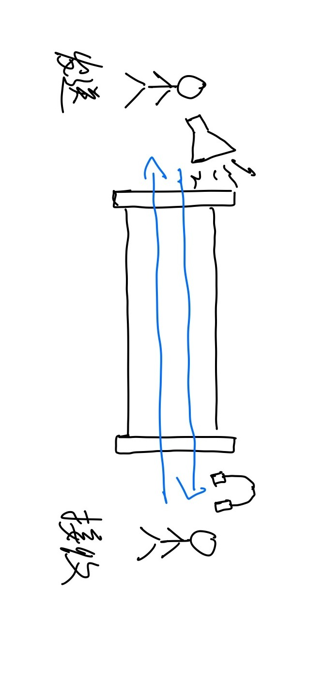

# Table of Contents

1.  [套接字程序中遇到的错误](#org4056053)
    1.  [部署时遇到的错误](#orga178da9)
        1.  [地址已占用](#org1588259)
    2.  [连接时遇到的错误](#org887ee76)
        1.  [数据阻塞](#orgf32fbb0)
        2.  [数据中断](#org768f735)
    3.  [传输数据时遇到的错误](#org833e9fa)
        1.  [数据乱码](#org5fc299e)
        2.  [传输效率过低](#org30473a7)
    4.  [关闭](#orgbb479f6)

# 套接字程序中遇到的错误

    

套接字编程中遇到的错误，可以通过发生的场景分为4部分，与前文的四步骤一一对应  

## 部署时遇到的错误

### 地址已占用

关闭服务端套接字时，服务端所使用的端口状态还是 **TIME\_WAIT** ，端口还在被占用  
再次启动服务端程序时，会发现 *address already in use*  

要解决这个问题，只需在服务端套接字 *bind* 前，  
设置 *SO\_REUSEADDR* 属性  

    int on = 1;
    setsockopt(sockfd, SOL_SOCKET, SO_REUSEADDR, &on, sizeof(on));

## 连接时遇到的错误

  
*connect* 与 *accept* 连接了两个套接字，这里看作两个套接字之间有一个管道将他们相连  

那么遇到的问题可以分为  

### 数据阻塞

数据传输的阻塞有可能是网络的问题，也有可能是电脑死机无法响应数据，  

这个时候我们可以在对端为 *read* 设置超时时间  

    struct timeval tv;
    tv.tv_sec = 5;
    tv.tv_usec = 0;
    setsockopt(connfd, SOL_SOCKET, SO_RCVTIMEO, (const char *) &tv, sizeof tv);

也可以在轮询的时候设置超时，这里先不做探讨  

然后我该怎么知道是发生了超时事件 ？？  
此时/read/ 返回 -1， 并且 *errno* 为 *EAGAIN* 或 *EWOULDBLOCK*  
****tips****  
鬼知道这两个错误码什么意思，先用着好了  

### 数据中断

此时维持双方数据传输的通道断裂，可能是由于程序崩溃引起的  
此时在崩溃的一方，操作系统回收资源，自动调用 *shutdown*    

若 **数据发送端** 没有崩溃，调用 *write* 时触发 *SIGPIPE* 信号，  
此时返回值为 **-1**,并且 *errno = EPIPE*  

若 **数据接收端** 没有崩溃， 调用 *read* 时会接收到 *EOF* 信号，返回值为 **0**  

遇到这种情况只能先手动关闭连接了  
****tips****  
遇到 *SIGPIPE* 时，程序一般会退出，如果不想退出可以调用  

    signal(SIGPIPE, SIG_IGN); // SIG_IGN: signal ignore

## 传输数据时遇到的错误

### 数据乱码

> 不同的CPU有不同的字节序类型 这些字节序是指整数在内存中保存的顺序 这个叫做主机序  

怕什么，整数的问题关我字节流什么事，直接把数据指针强制转化为 *const char \** 发送即可  

    send(connfd, (const char *)&data, sizeof(data), 0);

### TODO 传输效率过低

要传输的数据量太小，就像澡堂里就一个人洗澡，老板得陪死  
为了解决这个问题，我们可以用 *writev* 与 *readv* 函数来处理数据读写  
这两个函数可以 **聚集写** ， **散布读**  

    #include <sys/uio.h>
    ssize_t readv(int fd, const struct iovec *iov, int iovcnt);
    ssize_t writev(int fd, const struct iovec *iov, int iovcnt);

但我好像不会用啊  

## 关闭

好像没有诶  

